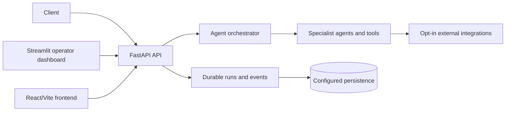

# AgentSystem

AgentSystem is a Python multi-agent orchestrator with a FastAPI API, a
Streamlit operator dashboard, and a React/Vite mission-control frontend. It
routes work to specialist agents and records durable runs, events, approvals,
artifacts, and evaluation data where the configured backend supports them.

## Status

The repository currently contains a combined Python container and a durable-run
API surface. The Azure architecture in [the deployment plan](.azure/deployment-plan.md)
is the **deployment target**, not a claim that all target services or controls
are already provisioned. In particular, the target's multi-service Container
Apps topology, private networking, managed-identity-only data access, and
production approval gates require the corresponding infrastructure rollout.

## Architecture



See [architecture and API contracts](docs/architecture.md) for current
behavior, the planned Azure topology, and resumable SSE semantics.

## Quickstart

Prerequisites: Python 3.12+, Node.js 22+ for the frontend, Docker for sandbox
tests and container builds, and optionally Azure CLI/AZD for infrastructure
validation.

```powershell
python -m venv .venv
.venv\Scripts\Activate.ps1
python -m pip install --upgrade pip
python -m pip install -r requirements-dev.txt
Copy-Item .env.template .env
python -m api.main
```

The API serves on `http://localhost:8080`; use `/docs` for its generated API
schema. Configure an LLM provider in `.env` before submitting chat work.

```powershell
Set-Location frontend
npm ci
npm run dev
```

## Validation

```powershell
python -m compileall -q agents agentsystem api enforcement evals guardrails memory routing telemetry tools workflows
ruff check --select E9,F63,F7,F82 agents agentsystem api enforcement evals guardrails memory routing telemetry tools workflows tests
python -m pytest -q --cov=agentsystem --cov=api --cov=agents --cov=tools --cov=workflows --cov-fail-under=35

Set-Location frontend
npm ci
npm run lint
npm test
npm run build

Set-Location ..
az bicep build --file infra\main.bicep
az bicep build --file infra\resources.bicep
docker build --pull --file frontend\Dockerfile --tag agentsystem-frontend:local frontend
docker build --pull --file apps\api\Dockerfile --tag agentsystem-api:local .
docker build --pull --file apps\worker\Dockerfile --tag agentsystem-worker:local .
docker build --pull --file apps\operator\Dockerfile --tag agentsystem-operator:local .
```

## Documentation

- [Local development](docs/local-development.md)
- [Architecture, API, and run events](docs/architecture.md)
- [Security model and threat model](docs/security.md)
- [Deployment and PostgreSQL migration](docs/deployment.md)
- [Operations, SLOs, recovery, and cost controls](docs/operations.md)
- [Evaluation strategy](docs/evaluation.md)
- [Contributing](CONTRIBUTING.md) and [security reporting](SECURITY.md)

## Delivery automation

`Verify` is the required GitHub Actions workflow: backend quality/tests,
frontend validation, Bicep builds, container builds, dependency review,
CodeQL, secret detection, Trivy filesystem scanning, and an SPDX SBOM artifact.
`Staged Azure deployment` is manual and uses GitHub Environment protections,
Azure OIDC, an AZD preview, and a commit-SHA image tag. Configure its
environment variables and approvals as described in
[deployment documentation](docs/deployment.md).
