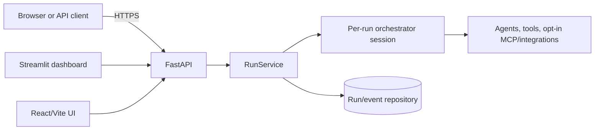
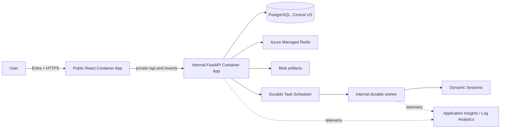

# Architecture and API contracts

## Current implementation

The current repository exposes FastAPI routes, Streamlit, and a React/Vite
frontend. Durable-run routes persist runs and events through the configured
repository/session layer; the production service topology described below is a
target, not a statement that it is already deployed.



## Azure deployment target



Only the UI is public in the target. The API, worker, data services, and
operator console are private. PostgreSQL remains in Central US by the approved
regional exception; application compute is in East US 2.

## Durable run API

The versioned run surface is mounted at `/api/v1/runs`:

| Method | Path | Meaning |
|---|---|---|
| `POST` | `/` | Create and execute a run. |
| `GET` | `/` | List scoped runs; supports `session_id`, `status`, and bounded `limit`. |
| `GET` | `/{run_id}` | Return the scoped run and persisted events. |
| `POST` | `/{run_id}/cancel` | Request cancellation. |
| `GET` | `/{run_id}/events` | Stream real persisted SSE events. |

Create input is `message`, optional `session_id`, optional `preferred_agent`,
and optional `idempotency_key`. A run response includes identifiers, status,
route/agent selection, input/output, sanitized error code, usage, and
timestamps. The compatibility chat API remains at `/api/v1/chat`.

## Event and SSE contract

Events are persisted before delivery and have a monotonic per-run `event_id`.
The canonical event types are `run.started`, `plan.updated`, `agent.selected`,
`tool.started`, `tool.completed`, `approval.requested`, `approval.decided`,
`artifact.created`, `message.delta`, `message.completed`, `run.completed`,
`run.failed`, and `run.cancelled`.

`GET /api/v1/runs/{run_id}/events` emits:

```text
id: 42
event: tool.completed
data: {"tool":"...","result":"..."}

```

Clients reconnect with `Last-Event-ID: 42` (or
`?last_event_id=42`). The server resumes strictly after the greatest supplied
cursor. Clients must de-duplicate by `(run_id, event_id)` and treat terminal
events as completion. SSE carries actual persisted progress; it is not a
synthetic token stream. Authorization and tenant/workspace scope are checked
before a stream begins.
