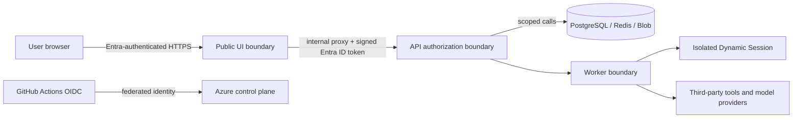

# Security model and threat model

## Security model

The current application has application-level authentication/configuration and
tenant-aware durable-run code. The following are deployment-target controls
from the approved plan and must be verified in Azure before being represented
as operational: Entra-authenticated public UI, internal API ingress, private
endpoints, managed identities, Entra-only Redis/PostgreSQL access, Key Vault
references, and registry hardening.

Target authorization is layered:

1. Entra authenticates a user at the public UI.
2. The API resolves a principal and checks tenant, workspace, project, and
   resource ownership on every request.
3. Repositories scope durable objects by tenant and workspace; database RLS is
   defense in depth when enabled.
4. Frontend, API, worker, and operator each use a dedicated user-assigned
   identity. Each identity receives only the data-plane and image-pull roles
   required by that workload.

No client receives provider exceptions, credentials, or internal dependency
details. Production secrets belong in Key Vault references; managed identity is
used for Azure OpenAI, Blob Storage, Dynamic Sessions, Durable Task, Redis,
PostgreSQL, and image pulls. GitHub deployment uses OIDC federation rather than
an Azure deployment principal secret. The unavoidable Entra provider credential
for Container Apps built-in authentication is held as a protected GitHub
Environment secret and materialized into Key Vault.

## Trust boundaries

| Threat | Control and verification |
|---|---|
| Cross-tenant data access | Tenant/workspace checks at API and repository boundaries; run SSE is checked before streaming; test negative-scope cases. |
| Credential disclosure | `.env` excluded from source, Gitleaks in CI, Key Vault/managed identity target, short-lived OIDC tokens. |
| Supply-chain compromise | Dependency review, Dependabot, CodeQL, Trivy, SBOM artifact, and container build validation. |
| Unsafe agent/tool execution | Require explicit approvals for sensitive actions; target cloud code execution only in network-restricted Dynamic Sessions; audit actions. |
| Public data-plane exposure | Target private endpoints and disabled public access after private-path smoke testing. |
| Injection and malicious tool output | Validate structured inputs, minimize tool permissions, sanitize errors/output, and retain auditable run events. |
| Denial of service/cost abuse | Auth, scoped rate limits, bounded worker/session scale, timeouts, budgets, and alerting. |

The frontend and operator use Container Apps built-in authentication. Their
proxies forward the signed Entra ID token—not the forgeable principal
headers—to the internal API. The API validates that token's signature, issuer,
audience, and lifetime in `entra_jwt` mode. Internal ingress remains defense in
depth rather than the source of identity trust.

## Secret handling

- Store no credential in GitHub repository variables, code, logs, images, or
  Bicep output. GitHub Environment variables contain only non-secret identity
  and resource names; the Entra provider credential is a protected Environment
  secret.
- Use separate identities per runtime component and federated credentials
  restricted to the repository, branch/tag policy, and GitHub Environment.
- Rotate or revoke exposed secrets immediately, then assess audit logs and
  dependent systems. Do not paste a suspected secret into an issue.

Report vulnerabilities as described in [SECURITY.md](../SECURITY.md).
